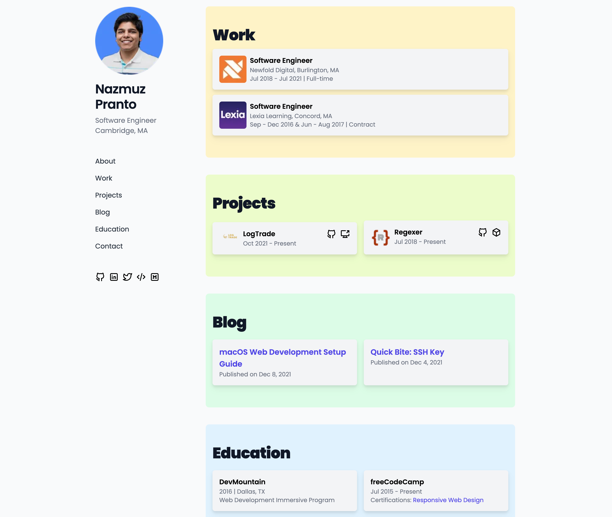

<div align="center">
  <a href="https://npranto.dev/">
    
  </a>

  <h2 align="center">npranto.dev</h2>

[](https://npranto.dev/)
[](https://www.linkedin.com/in/npranto/)

[](https://app.netlify.com/sites/npranto/deploys)
[](https://dashboard.cypress.io/projects/9d9vq3/runs)

</div>

<!-- ABOUT THE PROJECT -->

## About

A static personal portfolio website to showcase projects, work experiences and blogs. See it [live](https://npranto.dev/).

<div>
  
</div>

## Built With

- HTML
- CSS
- JavaScript
- [Tailwind CSS](https://tailwindcss.com/)
- [Parcel](https://parceljs.org/)
- [Cypress](https://www.cypress.io/)
- [ESLint](https://eslint.org/)
- [Prettier](https://prettier.io/)

## Prerequisites

To get started on development, let's install a few prerequisites

- npm
  ```sh
  npm install npm@latest -g
  ```

## Installation

1. Clone the repo
   ```sh
   git clone https://github.com/npranto/personal-portfolio.git
   ```
2. Install NPM packages
   ```sh
   npm install
   ```
3. Start up local development server
   ```sh
   npm run dev
   ```
4. To keep E2E test running on the background
   ```sh
   npm run cypress:open
   ```

## Contributing

Follow the list of procedures below to start contributing or make updates to portfolio

1. Create a new issue on the [issue](https://github.com/npranto/personal-portfolio/issues) board
2. Create a new branch from `master` branch, i.e., `git checkout -b pp-105`. _Note: `105` refers to the issue id and `pp` is just a prefix, stands for personal portfolio_
3. Make changes inside `components` and `pages` directory
4. Before committing all changes:
   1. Ensure all end-to-end tests are passing w/ Cypress - `npm run cypress:open`
   2. If needed, add new tests inside cypress for new functionalities or features added
   3. Create a new production build, run `npm run build`.
   4. To see preview of build, run `npm start`
   5. Verify all changes are reflected correctly on the new build
5. Commit and push changes to remote origin on the new branch
6. Create a pull request from the new branch => `master` branch
7. Notice, Netlify will automatically create a preview URL w/ the new changes on the pull request
8. Verify all changes and merge the pull request
9. Refer back to the original issue, link the pull request, add assignee, and mark issue as closed

## Netlify Build Settings

**Note**: Before deploying to production, update the following settings inside Netlify:

- Build command - `npm run build`
- Publish directory - `.next`
- Production branch - `v3.0.0`
- Enable plugin for essential features for Next.js on Netlify

## Release Process

- Generally, when you want to release the latest work, you want to merge the `wip` (Work In Progress) branch to both `master` and the next release branch (i.e., `v4.0.0`). In addition, you will also need to configure your Netlify settings to properly deploy the right branch to production. So, just for a quick recap, we have many different versions of the portfolio sitting on GitHub server under a specific branch name, i.e., (`v1.0.0`, `v2.0.0` and so on). We have the flexibility to switch between different versions anytime we want just from Netlify. Our `master` branch basically keeps track of all of our changes over time, but it is NOT the production branch that gets deployed. Rather, the production branch is set to a specific version branch, i.e., `v3.0.0`.

Follow the process below to release a feature / bug:

1. Create a new branch (i.e., `pp-132`, where `132` represents the issue ID) off of the portfolio version branch that you want to make updates to. For example, if you want to add a new feature to portfolio v2.0.0, then create the `pp-132` branch from `v2.0.0` branch.

```bash
git checkout v2.0.0
git checkout -b pp-132
```

2. Work on the feature or bug, commit and push the latest changes on the `pp-132` branch on remote origin
3. Before creating a new pull request, go over to project settings on Netlify - https://app.netlify.com/sites/npranto/settings/general. Update build command, publish directory and production branch to appropriate values to ensure proper build process is set based on the portfolio version. Refer to README.md file's `Netlify Build Settings` section for values to set. Since different versions of the portfolio could possibly have different build processes, we need to make sure Netlify builds our code appropriately on code merge.

Example: for v2.0.0, here the the Netlify build settings:

- Build command - `npm run build`
- Publish directory - `dist`
- Production branch - `v2.0.0`

4. Now, create a pull request to merge `pp-132` => `v2.0.0`
5. On the pull request, verify that cypress E2E tests are passing and Netlify preview build has all the latest changes. Note: if any of the E2E tests are failing or if the preview build does not have the latest changes, then go ahead and fix the code to reflect a clean slate
6. Assuming both tests and code changes are all valid and passing, go ahead and merge the pull request to `v2.0.0` branch
7. Netlify will kick off a new build your latest changes to production site - https://npranto.dev/
8. Assuming the build passes, go over to production and verify that latest changes are live and working as expected
9. Now, as the last clean up step, delete the `pp-132` directory as the release is complete

Remember, the production branch is what determines what version of the portfolio is currently active on production site. So, if we want to production site to reflect a new version of the portfolio, say `v5.0.0`, then we will need to create a new branch and ensure Netlify settings also reflect that branch as the production branch along w/ appropriate build command and publish directory.

## License

[MIT](https://tldrlegal.com/license/mit-license)

## Contributors

<div>
  <a href="https://github.com/npranto">
    
  </a>
</div>
