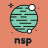
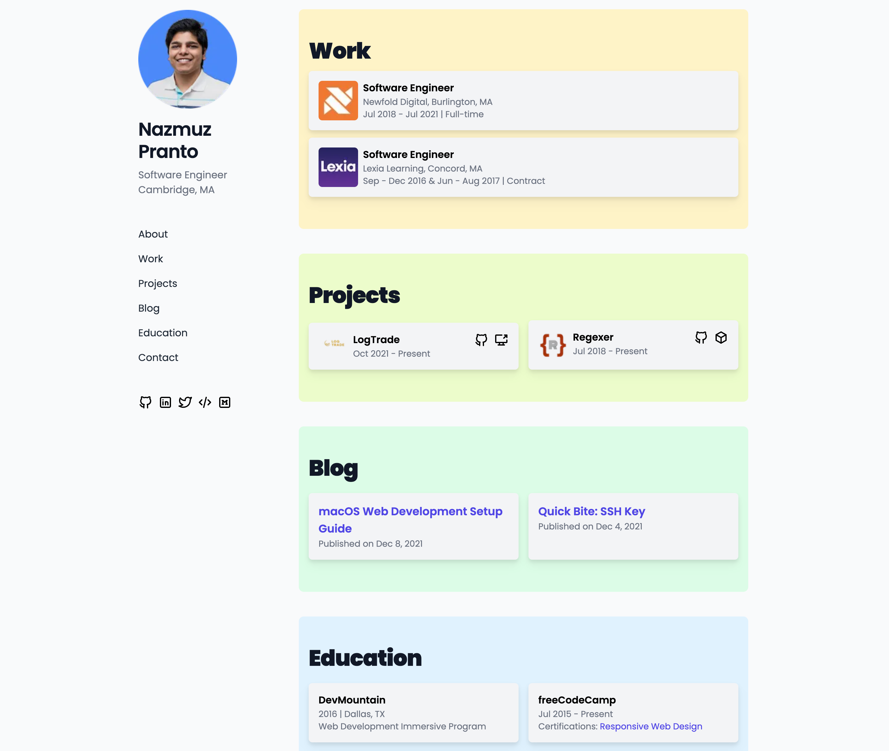

<div align="center">
  <a href="https://npranto.dev/">
    
  </a>

  <h2 align="center">npranto.dev</h2>

[](https://npranto.dev/)
[](https://www.linkedin.com/in/npranto/)

[](https://app.netlify.com/sites/npranto/deploys)
[](https://dashboard.cypress.io/projects/9d9vq3/runs)
[](https://sonarcloud.io/summary/new_code?id=npranto_personal-portfolio)

</div>

## About

A static personal portfolio website to showcase projects, work experiences and blog posts. See it [live](https://npranto.dev/).

<div>
  
</div>

## Built With

- HTML
- CSS
- JavaScript
- [Tailwind CSS](https://tailwindcss.com/)
- [Parcel](https://parceljs.org/)
- [Cypress](https://www.cypress.io/)
- [ESLint](https://eslint.org/)
- [Prettier](https://prettier.io/)

## Prerequisites

To get started on development, let's install a few prerequisites

- npm
  ```sh
  npm install npm@latest -g
  ```

## Installation

1. Clone the repo
   ```sh
   git clone https://github.com/npranto/personal-portfolio.git
   ```
2. Checkout branch `v5`
   ```sh
   git checkout v5
   ```
3. Install NPM packages
   ```sh
   npm install
   ```
4. Start up local development server
   ```sh
   npm run dev
   ```
   _Note: You will need to setup a `.env` file with a few environmental variables to fetch contents from remote CMS (Contentful). Refer to Netlify environmental variables for that_
5. (Optional) To keep unit tests running on the background
   ```sh
   npm run test:watch
   ```
6. (Optional) To keep E2E test running on the background
   ```sh
   npm run cypress:open
   ```

## Contributing

Follow the list of procedures below to start contributing or make updates to portfolio

1. Create a new issue on the [issue](https://github.com/npranto/personal-portfolio/issues) board
2. Create a new branch from `v4` branch, i.e., `git checkout -b v4-105`. _Note: `105` refers to the issue id and `v4` is just a prefix, stands for version 4 iteration of personal portfolio_
3. Make code or content changes as necessary. Code changes usually go inside `src` directory while content changes sit inside [Contentful](https://app.contentful.com/spaces/e0cj9bej8ddl/entries?id=JE9JMg1ZWONGpXCc&order.fieldId=updatedAt&order.direction=descending&displayedFieldIds=contentType&displayedFieldIds=updatedAt&displayedFieldIds=author).
4. Before committing all changes:
   1. Ensure all end-to-end tests are passing w/ Cypress - `npm run cypress:open`. (Note: you may need to run `npm run dev` on the background as well). If needed, add new tests inside cypress for new functionalities or features added.
   2. Ensure all unit tests are passing - `npm run test`. (Note: you may need to run `npm run dev` on the background as well)
   3. To see production preview, create a new production build - `npm run prod`, run preview local server - `npm run preview` and open http://localhost:9000/
   4. Verify all changes are reflected correctly on the preview
5. Commit and push changes to remote origin on the new branch
6. Create a pull request from the new branch => `v4` branch
7. Create a Netlify preview to see the latest changes in an URL

- kick off `Deploy Branch To Bucket` Github Action workflow
- pass in branch name to deploy
- pass in any one of these buckets (`bucket-1`, `bucket-2`, `bucket-3`, `bucket-4`, `bucket-5`, `qa-1`, `qa-2`, `qa-3`),
- log into [Netlify](https://app.netlify.com/sites/npranto/deploys) to see if build finished
- once done, visit `https://bucket-1--npranto-dev.netlify.app/ to see preview

8. Note, Healthcheck will also get triggered through GitHub Actions workflow
9. Verify all changes and merge the pull request
10. Ensure that a new version tag has been created in the commit logs, i.e., `v4.1.3`. This is crucial as it will be used to deploy a specific tag to `production` during a release at some point in the future
11. Refer back to the original issue, link the pull request, add assignee, and mark issue as closed

## License

[MIT](https://tldrlegal.com/license/mit-license)

## Contributors

<div>
  <a href="https://github.com/npranto">
    
  </a>
</div>
